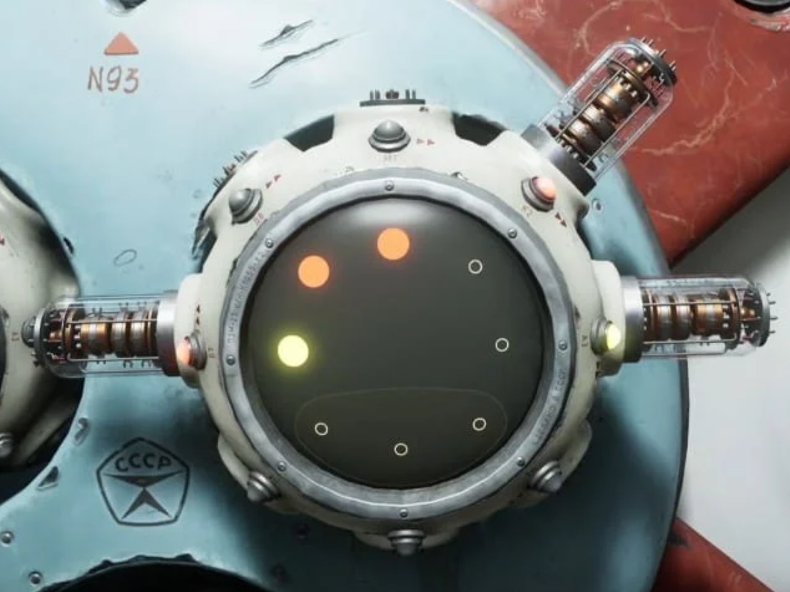

### Atomic Heart Dots Lock Cracker (Command Line Version)

#### Introduction

This is a Command Line version of an app that helps players unlock dots lock quickly in the game **Atomic Heart**.
The user needs to input two arrays that represent the original pattern and the target pattern of the lock,
and the app will output one possible sequence of the shortest path to unlock the lock by
pressing the corresponding sequence of keys on the PS5 controller.

#### Installation

Please download the binary packages of released versions according to your OS.

#### Usage

After running the app, it will ask for the original pattern and the target pattern. The pattern is a line of a string consisting
of eight numbers separated by a single space, such as **0 0 0 0 0 0 0 0**. Here, we use each number to represent status in one
dot in the circle lock.

The default mapping of numbers to colors is 0 for no-color, 1 for yellow, 2 for blue, 3 for red, etc.
The user can define a unique number for each color as long as the mapping rule has no conflicts and
is the same for both patterns. Note that the app only allows numbers between 0 and 8.

Additionally, the pattern starts from 12 o'clock and goes clockwise, where the first number in the array represents
the status of the slot in the 12 o'clock direction.

For example, the original pattern of the lock below is **3 0 0 0 0 0 1 3**, and the target pattern is on the outer round of the lock,
which is **0 3 1 0 0 0 3 0** here:

#### Build (Optional)

To build the app yourself, for example on a linux-amd64 machine, do the following in the main directory:

```shell
# make sure cmake >= 3.18 and g++ supports C++17 installed
cmake .
make
./DotsLockCracker 30000013 03100030
```



After inputting the two patterns, the app will print out the number of steps required on the shortest path,
the updated status of the lock on each step, and the sequence of controller keys for PS5 required to unlock the lock:

**L2 X X R2 X L2 X X R2 X L2**

Just follow the sequence to unlock.

#### Notice

* To make the app support the game on other platforms, the user can modify the key mappings in the source code and re-build.
* To build, make sure you have CMake (version>=3.18) and C++ Compiler that supports C++ 17 standards installed.

#### Author

Harrison S
